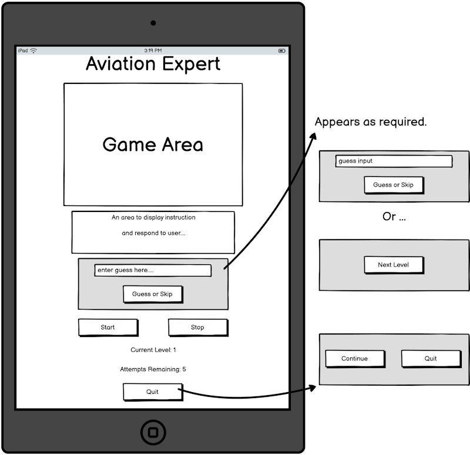
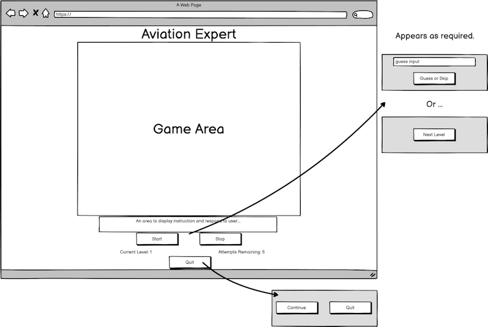
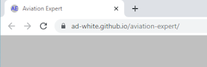
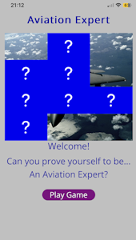
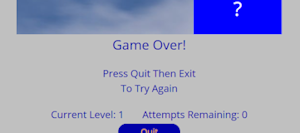
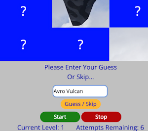
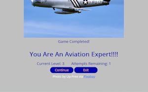

# Aviation Expert

This website features a game consisting of knowledge, skill and luck.

A fun guessing game where a player is given a number of attempts to try and select the tile of their choice using the random tile selector.
Once the player selects a tile it disappears, revealing a portion of a larger image featuring an aircraft, hidden behind the tiles.
The player is then prompted to enter their guess as to the name of the aircraft being obscured. Or to skip and try again, by selecting another tile to reveal.
This continues until the player has used all their allotted attempts. At which point it's game over.
If the player guesses correctly, a message of congratulations is displayed, and an option of continuing to another level is offered.
At present the game features three levels. As the levels progress the number of attempts on offer reduce, adding an extra layer of difficulty.
If the player succeeds to guess all three aircraft correctly, they have completed the game.

The idea for this project is the result of a conversation with my brother, Matt.
He was describing a game to me. One I hadn't heard of at the time, called Cardle, a daily car quiz.
Here is a link to that game...  [Cardle](https://cardle.uk/).
He wanted to know whether it would be possbile to make something like it but for aircraft. 
As that's one of his passions and would like to play a game along those lines.

During my brothers description of the game, the interpretation I was having in my mind was different to the actual game he was describing.
In my mind the game featured what is now the tile selector of this game.
I have also developed this game differently, by trying to make it more like a game appplication.
Featuring levels, and those levels containing an element of difficulty by reducing the number of attempts a player can have.

I hope you enjoy the game!

You can view the site on Am I Responsive [here](https://ui.dev/amiresponsive?url=https://ad-white.github.io/aviation-expert/)

The live link can be found [here](https://ad-white.github.io/aviation-expert/)

## User Experience (UX)

My intended and expected audience, (aside from my brother), will mainly consist of family and friends.
Therefore an audience with knowledge of aircraft from zero to enthusiast.

I have made this game hoping to provide a fun, not too serious game of identification of aircraft.
I have intended to make it simple and easy to use, so as to be both a playable and enjoyable experience.
With consideration to my expected audience, the aircraft I have chosen to include are generally well known.
Also, the accepted answer has been kept relatively short and not overly in-depth.

## User Stories
### New Site Users

- As a new site user, I would like to play a game and attempt to identify the aircraft being hidden by tiles.

- As a new site user, I would like to have multiple attempts of using the tile selector in order to try and guess the correct answer.

- As a new site user, I would like to be able to skip my attempt to guess, if I have no idea as to the aircrafts identity.
 
- As a new site user, I would like to continue playing the game by having the option of trying a new level if my answer is correct.

- As a new site user, I would like to be able to quit the game at any time if I wish. Or to change my mind and continue playing.

### Returning Site Users

- As a returning site user, I would like to play the game again but, with a diffent set of aircraft.

## Design

### Colour Scheme

I have chosen a simplistic yet bright colour scheme. One of primary and secondary colours.
These will be used against a silver coloured background to provide good contrast and give a colourful, overall appearance.
My intention is for this to help clearly distinguish the game board of tiles from the background, and the gameboard from the players control buttons and text input.
I have chosen what I hope to be colours that will be intuitive for the player to use as the main game controls.

- `#c0c0c0` - silver - used for background.
- `#0000ff` - blue - used for game tiles.
- `#0000A8` - blue - used for primary text.
- `#ffffff` - white - used for button text.
- `#008000` - green - used for start button.
- `#B30000` - red - used for stop button.
- `#FFB833` - orange - used for the guess / skip button.
- `#800080` - purple - used for next level button.
- `#0000A8` - blue background + `#FFB833` - orange text - used for quit and continue buttons.

### Typography
 
 In keeping with a clean and simple feel to the site. Also, in order to offer a high degree of readability.
 I have opted for an Open Sans typeface.

- [Open Sans](https://fonts.google.com/specimen/Open+Sans) was used for the primary text across the site.

 
### Imagery

All images used throughout this site have been sourced from [Pixabay](https://pixabay.com/).

### Wireframes

To follow best practice, wireframes were developed for mobile, tablet, and desktop sizes.
I've used [Balsamiq](https://balsamiq.com/wireframes) to design my site wireframes.

### Game Page Wireframes

| Size | Screenshot |
| --- | --- |
| Mobile |  |
| Tablet |  |
| Desktop |  |

## Features

### Existing Features

**Responsive Design** 
- A mobile first, responsive design. Tested for use with Chrome, Safari, and Firefox across a variety of devices. Mobile, tablet and desktop.
	 

**Favicon** 
- A favicon, making it easy to identify this site among other open tabs within the users browser. 

**Home Page**
- A home page with title and static image of the game, featuring a welcome message and Play Game button.

**Game Area**
- Features a game board of tiles with simple, colourful controls for the player.
- Including both a current level and atttempts remaining information area.

**Random Tile Selector With Reveal**
- Features a generator to randomly select the game image to be used and sets it behind the tiles.
- The selector continues to select and highlight a tile at random, until the user presses the stop button. 
- At which time the tile disappears, revealing a part of the hidden image.

**All Remaining Tiles Revealed**
- If the players answer matches the stored answer, all remaining covering tiles are removed.

**Message Area**
- A message area for displaying information to the player.
- Information such as instructions to help the flow of the game.
- Messages of Congratulations or Game Over, etc.

**User Input Area**
- Features a text input, with placeholder message, for the player to make their guess. 
- Also includes a Guess / Skip button for the player to use.
- This feature activates whenever the tile selector has stopped and revealed whatever it may be covering.
- The text input also features a regEx pattern. This is to help cover possible user answers where they may enter a range of potential responces in naming what they see. Due to the nature of the subject. I am expecting hyphen or white space when writing the aircrafts name. E.g. F-18 Hornet, could also be entered as F18 Hornet, F18 hornet, f18 hornet, f-18 Hornet, etc. Any leading or trailing white space that has been entered is also removed from the users input. Their answer is also converted to all lowercase, before the comparison is made with the accepted answer. 
- I have applied the same regEx pattern to the value received from the key `gameImageName` (the accepted answer to the assocciated image). This is to help achieve a direction comparison to the guess the user has entered. Also, the aim is to allow for more human like answers when filling the `gameImageSelection`. Making the inclusion of more aircraft or anyother subject matter easier. Either by myself or another developer in the future.

**Quit Button**
- This quit button is always available incase the user decides to stop playing the game.
- It has a saftey mechanism of displaying two buttons.
- A button to allow the continuation of play, if they have changed their mind or have mistakenly pressed the button.
- The other button to definitely exit.

- Continue Or Exit

**Footer With Photographer Attribution**
- The footer contains a message and credit to the website and content creator of the current photograph in play.

**Multiple Level Design**
- This game come with three levels in total. Each level has the ability to set the number of attempts required.

**404 Response Page**
- This game come with a 404.html page, to help the user navigate back to the home page. 
Adding to a nicer user experience, if something unexpected goes wrong.

### Future Implementations

**High Score System**
- Adding backend technology to allow players to sign up to the site.
- Allowing the capturing of each players progress to then implement a highscore record.

**Increase or Decrease Difficulty**
- Give the player the ability to set a pre-defined level of difficulty e.g. easy, medium, hard.
- Future implementations could involve adding more than one accepted answer. So allowing for more indepth and accurate naming of the aircraft.
- Another idea is to increase the number of tiles as the levels increase.

**Include More Levels**
- Add more levels.
- Extra levels can be added. By adjusting the gameLevel variable within the if statement of the StartGenerator function, and of the checkAnswer function.
- In addition to this, adding a repeat of the block of code in the if/else statement within the nextLevel function.

**Add Extra Aircraft**
- Include more aircraft of different types. e.g. small private planes, commercial aircraft, vintage aircraft, etc.
- Perhaps include a series of aircraft silouettes as an alternative.

**Create A Contact Page**
- Create a contact page featuring Email.js to handle sending emails. I hope this give users the ability to contact me with any game related suggestions/requests. Or to able to inform me of any issues they may experience with the game.

**Future Re-development Considerations**
- During the development of this application. I took consideration to not naming anything "aviation" or "aircraft" in relation to the overall game/game engine related code and variables. 
- I did this so as to only require re-naming, the game title, two messages within the game (the welcome text and game completed text). Then to simply replace the images and required answers for them, in order to create an entirely new game subject matter.
- I have done this as in the future I aim to re-develop this game with cars as a theme. As I have now received a few requests from friends to do so.

### Accessibility

I have designed this website with the intention of making it easy for all users to navigate and enjoy.
I have tried to adhere to current best practices during the production of this website.
I have tested the website using Google Lighthouse.
I have implemented changes to my design as a response to any issues resulting from this testing.

## Technologies Used

### Languages Used

HTML, CSS and JavaScript.

### Frameworks, Libraries & Programs Used

- [Balsamiq](https://balsamiq.com/wireframes) to design my site wireframes.
- [Replit Mobile Application](https://replit.com/mobile) to work on this project from anywhere, anytime I wasn't at home.
- [Visual Studio Code](https://https://code.visualstudio.com) to work on development when not using Replit.
- [Google Fonts](https://fonts.google.com) used to import the font used within the site.
- [Bootstrap](https://getbootstrap.com) used as the front-end CSS framework for modern responsiveness and pre-built components.
- [AutoRegEx](https://www.autoregex.xyz) used to generate regEx used in checkAnswer function.
- [Git](https://git-scm.com) used for version control. (`git add`, `git commit`, `git push`)
amiresponsive
- [GitHub](https://github.com) used for secure online code storage.
- [GitHub Pages](https://pages.github.com) used for hosting the deployed front-end site.
- [Gitpod](https://gitpod.io) used as a cloud-based IDE for development.
- Google Dev Tools - Accessed from Google Chrome.

## Deployment & Local Development

### Deployment

The site was deployed to GitHub Pages. The steps to deploy are as follows:
- In the [GitHub repository](https://github.com/Ad-White/aviation-expert), navigate to the Settings tab 
- From the source section drop-down menu, select the **Main** Branch, then click "Save".
- The page will be automatically refreshed with a detailed ribbon display to indicate the successful deployment.

The live link can be found [here](https://ad-white.github.io/aviation-expert)

### Local Deployment

This project can be cloned or forked in order to make a local copy on your own system.

#### Cloning

You can clone the repository by following these steps:

1. Go to the [GitHub repository](https://github.com/Ad-White/aviation-expert) 
2. Locate the Code button above the list of files and click it 
3. Select if you prefer to clone using HTTPS, SSH, or GitHub CLI and click the copy button to copy the URL to your clipboard
4. Open Git Bash or Terminal
5. Change the current working directory to the one where you want the cloned directory
6. In your IDE Terminal, type the following command to clone my repository:
	- `git clone https://github.com/Ad-White/aviation-expert.git`
7. Press Enter to create your local clone.

Alternatively, if using Gitpod, you can click below to create your own workspace using this repository.

Please note that in order to directly open the project in Gitpod, you need to have the browser extension installed.
A tutorial on how to do that can be found [here](https://www.gitpod.io/docs/configure/user-settings/browser-extension).

#### Forking

By forking the GitHub Repository, we make a copy of the original repository on our GitHub account to view and/or make changes without affecting the original owner's repository.
You can fork this repository by using the following steps:

1. Log in to GitHub and locate the [GitHub Repository](https://github.com/Ad-White/aviation-expert)
2. At the top of the Repository (not top of page) just above the "Settings" Button on the menu, locate the "Fork" Button.
3. Once clicked, you should now have a copy of the original repository in your own GitHub account!

## Testing

For all testing, please refer to the [TESTING.md](TESTING.md) file.

## Credits

### Content

| Source | Location | Notes |
| --- | --- | --- |
| [Bootstrap](https://getbootstrap.com/docs/5.3/getting-started/introduction/) | entire site | responsive |
| [W3Schools](https://www.w3schools.com/) | entire site | general resource |
| [Mozilla Javascript Reference](https://developer.mozilla.org/) | entire site | general resource |
| [Stackoverflow](https://stackoverflow.com/) | entire site | general resource |
| [Pixabay](https://pixabay.com/) | entire site | photographs of aircraft |
| [Markdown Builder by Tim Nelson](https://traveltimn.github.io/markdown-builder) | README and TESTING | tool to help generate the Markdown files |

### Media

All photographs used throughout this site have been sourced from [Pixabay](https://pixabay.com/).
Pixabay state there is no requirement to credit Pixabay or its content contributors.
However, I feel it is of importance, so I have given attribution to both within the game itself.
  
### Acknowledgments

- I would like to thank my Code Institute mentor, Rory Patrick Sheridan, for their invaluable feedback, support and encouragement throughout the development of this project.
- I would like to thank my tutor, Nigel Edwards from the College Of West Anglia, for their guidance, suggestions and assistance at various stages of developing this project. 
- I would like to thank those of my family and friends in helping to test this game. And providing valuable feedback.
- I would like to thank my partner Michelle, for believing in me, and continuing to support me in making this transition into software development.