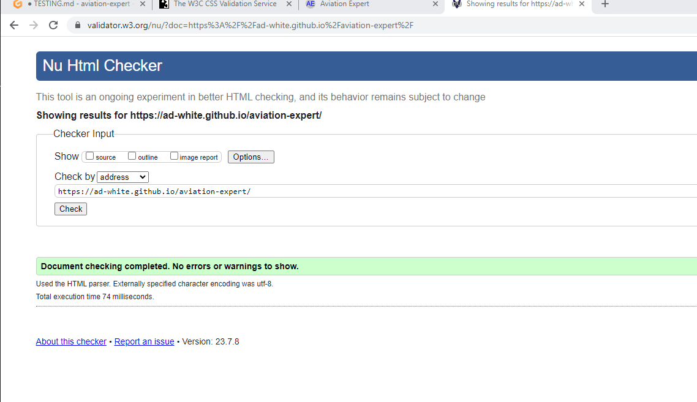

# Testing

Return back to the [README.md](README.md) file.

## Code Validation

### HTML

I have used the recommended [HTML W3C Validator](https://validator.w3.org) to validate my HTML.

To guarentee the testing of the tileTable code I had written.
I copy and pasted the large html section from within the script.js file containing the tileTable.
I then added that just under the welcome div within the game-area section in the index.html file.
I copy and pasted the result of this as a direct input into the validator.

| Page | W3C URL | Screenshot | Notes |
| --- | --- | --- | --- |
| By URI | [W3C](https://validator.w3.org/nu/?doc=https%3A%2F%2FAd-White.github.io%2Faviation-expert%2Findex.html) |  | Pass |
| By Direct Input| --- |  | Pass |

### CSS

I have used the recommended [CSS Jigsaw Validator](https://jigsaw.w3.org/css-validator) to validate my CSS file.

To get a result without the interference of bootstrap being tested along side my own code.
I copy and pasted the style.css file and tested using direct input.

| File | Jigsaw URL | Screenshot | Notes |
| --- | --- | --- | --- |
| style.css - testing by URL | [Jigsaw](https://jigsaw.w3.org/css-validator/validator?uri=https%3A%2F%2Fad-white.github.io%2Faviation-expert%2F&profile=css3svg&usermedium=all&warning=1&vextwarning=&lang=en) |  | Errors and Warnings - Result of trying to validate framework |
| style.css - testing by Direct Input | --- |  | Pass |

### JavaScript

I have used the recommended [JShint Validator](https://jshint.com) to validate my JS file.

| File | Screenshot | Notes |
| --- | --- | --- |
| Congiguration Used For Test |  | ES6 setting used |
| script.js - Inital Report|  | Two warnings, eight undefined variables |
| script.js - Final Report|  | Final Result |

## Browser Compatibility

I've tested my deployed project on multiple browsers to check for compatibility issues.

| Browser | Home | Game Start | Guess | Incorrect Answer / Skip | Next Level | Game Over | Game Completed | Quit - Continue / Exit |  Notes |
| --- | --- | --- | --- | --- | --- | --- | --- | --- | --- | 
| Chrome |  |  |  |  |  |  |  |  | Works as expected |
| Safari |  |  |  |  |  |  |  |  | Works as expected | 
| Firefox | |  |  |  |  |  |  |  | Works as expected | 

## Responsiveness

I've tested my deployed project on multiple devices to check for responsiveness issues.

| Device | Home | Game Start | Guess | Incorrect Answer / Skip | Next Level | Game Over | Game Completed | Quit - Continue / Exit |  Notes |
| --- | --- | --- | --- | --- | --- | --- | --- | --- | --- | 
| Mobile |  |  |  |  |  |  |  |  | Works as expected |
| Tablet (DevTools) - Horizontal |  |  |  |  |  |  |  |  | Works as expected |
| Desktop |  |  |  |  |  |  |  |  |  Works as expected |

## Lighthouse Audit

I've tested my deployed project using the Lighthouse Audit tool to check for any major issues.

| Status | Test Used | Size | Screenshot | Notes |
| --- | --- | --- | --- | --- |
| Start | Navigation | Mobile |  | No warnings |
| Start | Navigation | Desktop |  | No warnings |
| Game | Snapshot | Mobile |  | No warnings |
| Game | Snapshot | Desktop |  | No warnings |
| Game In Play | Timespan | Mobile |  | Duration: 1 level - No warnings |
| Game In Play | Timespan| Desktop |  | Duration: 1 level - No warnings |

## Manual Testing

I have manually tested the game through its complete development.

Manually tested with the below user acceptance testing:

| Game State | User Action | Expected Result | Pass/Fail | Comments |
| --- | --- | --- | --- | --- |
| Home Page | | | | |
| | Click on Play Game button | Clear existing screen and load new game | Pass | |
| Game Page | | | | |
| | Click on Start button | Random Tile Generator starts | Pass | |
| | Click on Stop button to stop Random Tile Generator | Random Tile Generator stops | Pass | |
| | Click on Submit/Skip button to Submit a guess | Answer is submitted and check if correct or not | Pass | |
| | Click on Submit/Skip button to skip an attempt | Empty guess is submitted. Game displays message when an answer is incorrect. Then an attempt is removed | Pass | |
| | Click on Submit/Skip button to Submit with an incorrect guess | Answer is submitted. Game diplays message when an answer is incorrect. Then an attempt is removed | Pass | |
| | Click on Submit/Skip button to Submit a correct guess | Answer is submitted. Then game displays message when answer is correct along with the Next Level button | Pass | |
| | Click on Next Level button | Replaces current game screen with the next level | Pass | |
| | Click on Quit button | Quit button is removed and replaced with two buttons, Continue and Exit | Pass | |
| | Click on Continue button | The two buttons, Continue and Exit are removed and replaced with the Quit button | Pass | |
| | Click on Exit button | The page reloads to the home page | Pass | |
| | Navigate to non existant page | The page loads the 404.html response page | Pass | |

# Automatic Testing

No automatic testing has been conducted, using the likes of Jest for example.
I understand the benefits of automatic testing would be to ensure that what the developer/s have designed, pass tests which wouldn't necessarily show up through manual testing.
As well as being able to check for things in a fraction of the time, if compared to 
the equivalent human testing. E.g. testing a thousand key presses. 
In relation to this project, I can see that it would be of potential interest to test the total number of game combinations that can be achieved. At present, and after some research, I am led to believe that with a total set of fifteen images. With three being randomly selected as a sub-set. There are 455 combinations. This is something that would become very tedious and time consuming for a human to test!

## User Story Testing

### User Story Testing - Returning Site Users
| User Story | Screenshot - example |
| --- | --- |
| As a new site user, I would like to play a game and attempt to identify the aircraft being hidden by tiles. |  
| As a new site user, I would like to be able to skip my attempt to guess, if I have no idea as to the aircrafts identity. |  |
| As a new site user, I would like to have multiple attempts of using the tile selector in order to try and guess the correct answer. |  
| As a new site user, I would like to continue playing the game by having the option of trying a new level if my answer is correct. |  
| As a new site user, I would like to be able to quit the game at any time if I wish. Or to change my mind and continue playing. |  

### User Story Testing - Returning Site Users
| User Story | Screenshot - example |
| --- | --- |
| As a returning site user, I would like to play the game again but, with a different set of aircraft. (all potential aircraft within the game) |  

## Bugs

These four bugs were particular areas of game development that had me scrathing my head!

**Bug 01**
- Stopping the generator
- Once I had figured out a way to make the tile generator select a tile at random, apply the relevant class and move on to select another. I couldn't get the generator to stop.
- The solution I implemented was to create a variable, `generatorStarted` to act as a key-like mechanism to set the generator as either in an "On" or "Off" state.

**Bug 02**
- Resetting tiles between levels
- Once I had managed to get control over the generator. I wanted to build in some levels to the game. Which I managed to achieve after some attempts. However, now that a new game had started. All the previously uncovered tiles where still visible as transparent. Therefore, ruining the second level before the player could start the generator.
- My solution to this problem was to create an array, `highlightedTilesList`. This held onto each of the players revealed tiles, which could then be manipulated with adding and removing classes before the next level began.

**Bug 03**
- Handling the user answer and comparing with accepted answer.
- From the early stages of testing my answers against the accpeted answers. I found that any leading or trailing white space caused an otherwise correct answer to be false. Also, using capital letters in my answer didn't truely compare to the accepted answer.
- I decided to use the functions, `trim()` and `toLowercase()` in order to control the user's entered answer. I have also used this as a way to control the accepted answer. This pattern matching is also intended to prevent any future additions/answers to the game, which may not follow the all lowercase format at present; from becoming an issue during gameplay. In addition to this, the regEx pattern implemented is to further reduce any future issues concerning both the user's answer and accepted answer.

**Bug 04**
- "Jumping UI"
- This is related to a valuable piece of feedback I received.
- It is more noticable on tablet and desktop devices. The structure of the tile table, followed by the message area then, user answer area. Means that it causes the Start and Stop buttons to jump about with the inclusion of messages during game play. I could appreciate that this has the ability to lessen a players enjoyment.
- I have therefore, swapped the `
` with `id="buttons"`, to now follow the `tileTable`, and then the message area. I hope this achieves the aim of lessening the interference with the user interface.
- This bug was brought to may attention quite recently. Therefore, all images used within this document show the game UI before the change was made. In time I shall replace all affected images. For now, please see the live website.

	
**Fixed Bugs, Errors and Warnings**

| Bug | Status |
| --- | --- |
| [ Bug 01 ] - Stopping the generator | Bug fixed |
| [ Bug 02 ] - Resetting tiles between levels | Bug fixed |
| [ Bug 03 ] - Handling the user answer and comparing with accepted answer. | Bug fixed |
| [ Bug 04 ] - "Jumping UI".  | Bug fixed |

## Unfixed Bugs, Errors and Warnings

One warning - Relates to the Lighthouse report. Use of large images, recommending the use of a more modern image format to decrease loading times/data usage on mobile devices.
At present I haven't the technology to implement that change.

Any remaining errors or warnings to my knowledge, are as a result of the validating software, trying to validate external libraries and/or frameworks.

There are no remaining bugs that I am aware of.