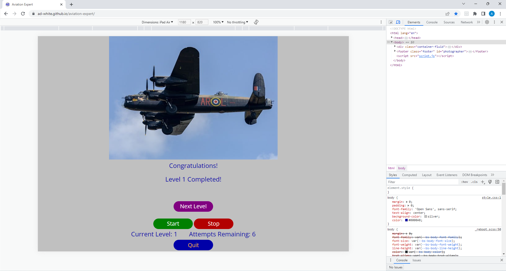

# Testing

Return back to the [README.md](README.md) file.

## Code Validation

### HTML

I have used the recommended [HTML W3C Validator](https://validator.w3.org) to validate my HTML.

To guarentee the testing of the tileTable code I had written.
I copy and pasted the large html section from within the script.js file containing the tileTable.
I then added that just under the welcome div within the game-area section in the index.html file.
I copy and pasted the result of this as a direct input into the validator.

| Page | W3C URL | Screenshot | Notes |
| --- | --- | --- | --- |
| By URI | [W3C](https://validator.w3.org/nu/?doc=https%3A%2F%2FAd-White.github.io%2Faviation-expert%2Findex.html) |  | Pass |
| By Direct Input| --- |  | Pass |

### CSS

I have used the recommended [CSS Jigsaw Validator](https://jigsaw.w3.org/css-validator) to validate my CSS file.

To get a result without the interference of bootstrap being tested along side my own code.
I copy and pasted the style.css file and tested using direct input.

| File | Jigsaw URL | Screenshot | Notes |
| --- | --- | --- | --- |
| style.css - testing by URL | [Jigsaw](https://jigsaw.w3.org/css-validator/validator?uri=https%3A%2F%2Fad-white.github.io%2Faviation-expert%2F&profile=css3svg&usermedium=all&warning=1&vextwarning=&lang=en) |  | Errors and Warnings - Result of trying to validate framework |
| style.css - testing by Direct Input | --- |  | Pass |

### JavaScript

I have used the recommended [JShint Validator](https://jshint.com) to validate my JS file.

| File | Screenshot | Notes |
| --- | --- | --- |
| Congiguration Used For Test |  | ES6 setting used |
| script.js - Inital Report|  | Two warnings, eight undefined variables |
| script.js - Final Report|  | Final Result |

## Browser Compatibility

I've tested my deployed project on multiple browsers to check for compatibility issues.

| Browser | Home | Game Start | Guess | Incorrect Answer / Skip | Next Level | Game Over | Game Completed | Quit - Continue / Exit |  Notes |
| --- | --- | --- | --- | --- | --- | --- | --- | --- | --- | 
| Chrome |  |  |  |  |  |  |  |  | Works as expected |
| Safari |  |  |  |  |  |  |  |  | Works as expected | 
| Firefox | |  |  |  |  |  |  |  | Works as expected | 

## Responsiveness

I've tested my deployed project on multiple devices to check for responsiveness issues.

| Device | Home | Game Start | Guess | Incorrect Answer / Skip | Next Level | Game Over | Game Completed | Quit - Continue / Exit |  Notes |
| --- | --- | --- | --- | --- | --- | --- | --- | --- | --- | 
| Mobile |  |  |  |  |  |  |  |  | Works as expected |
| Tablet (DevTools) - Horizontal |  |  |  |  |  |  |  |  | Works as expected |
| Desktop |  |  |  |  |  |  |  |  |  Works as expected |

## Lighthouse Audit

I've tested my deployed project using the Lighthouse Audit tool to check for any major issues.

| Status | Test Used | Size | Screenshot | Notes |
| --- | --- | --- | --- | --- |
| Start | Navigation | Mobile |  | No warnings |
| Start | Navigation | Desktop |  | No warnings |
| Game | Snapshot | Mobile |  | No warnings |
| Game | Snapshot | Desktop |  | No warnings |
| Game In Play | Timespan | Mobile |  | Duration: 1 level - No warnings |
| Game In Play | Timespan| Desktop |  | Duration: 1 level - No warnings |

